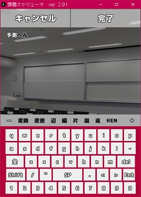
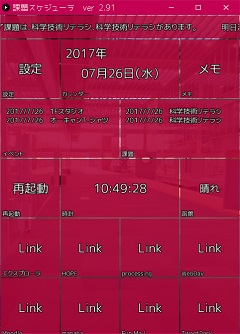
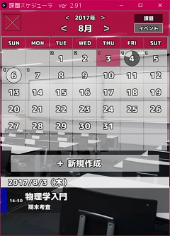

### 2017年processingスケジューラ全体発表　最優秀賞ありがとうございます！    

## ver 1.50bについて
原因不明で動かない部分をコメントアウトしている部分があります。

# スケジューラ
- - -  
【 タイトル 】課題スケジューラ  
【バージョン】ver 2.96L  
【　制　作　】TomSuzuki（1017055）  
【最終更新日】2017/07/27  
- - -  
　パスワードは "0000" に設定されています。  
　設定からパスワードの変更が可能です。  

  
## はじめに  
　　いつまでの課題がどれくらいの達成率か、どの科目にどれだけ時間をかけたかを知るためのソフトウェアです。新規作成から課題を追加して、前日に慌てて課題をやることが無いよう自分の課題を管理することができます。漢字の予測変換（っぽいもの）や視覚的にわかりやすい設定画面、文字の縁取りや色の変更で見やすくなるようなソフトウェアを目指しました。  
　　パスワードの暗号化が一部の数字だけで簡単にわかるって？そりゃ、このスケジューラで重要なのは見せる部分であって内部は...（おい  
　　そもそもプログラム見られるから自分の知識でいくら頑張っても無理な気がする。セキュリティ関連学んでみたいなぁ...  
  
　　追記：自分で使いたい機能を足していったらこうなりました。  
  
  
## 操作方法  
　　すべてマウスで操作します。（説明になっていないぞ）  
　　Ctr+V→キーボード画面でダブルクリックするとクリップボードにコピーしてある文字列を張り付けることができます。  
  
  
## Twitterのデータ  
　　ファイルのデータは上から  
　　　consumerKey  
　　　consumerSecret  
　　　accessToken  
　　　accessTokenSecret  
　　となっています。  
　　取得方法は自分で探してね☆  
  
  
## キャラクター（零）の説明  
　　　メイン画面で横スクロールをするとキャラクターが出現します。1か月前～昨日までの学習率から、アドバイスやメッセージを出します。  
　　絵が雑で下手なのは許してください...（7時間でキャラクターデザイン～メッセージのプログラムまでやった...←言い訳）  
  
  
## タイルの説明  
| タイル | 説明 |
|:---------|:---------|  
|カレンダー|カレンダーから日付ごとに課題の予定を見ることができます。|  
|課題|今日以降の課題を未完了、完了済、すべてで見ることができます。記録も見ることができます。|  
|イベント|今日以降のイベントを見ることができます。（課題との違いは達成率、記録がないことです。）|  
|記録|各月の学習時間の記録を見ることができます。|  
|リンク（Web）|インターネットショートカットです。|  
|リンク（アプリケーション）|アプリケーションショートカットです。|  
|メモ|メモ機能です。横にスライドで削除できます。|  
|設定|詳細な設定をすることができます。|  
|再起動|全てのデータをロードしなおします。|  
|終了|ソフトウェアを終了します。|  
|時計|現在の時間をデジタルで表示します。|  
|タイルの追加|新しいタイル（リンク）を追加することができます。|  

## 辞書の単語の追加
　　XXXuser.dic（XXXは何でもいい）に「ひらがな（またはアルファベット）,変換後」のデータをUTF-8でdata/dic/にい追加してください。  
  
  
## テーマの追加と背景イメージの追加
  　テーマはthemeに入っているものをコピーして置き替えてください。  
　　イメージは480*640のサイズの.pngか.jpgまたは.bmpをimageフォルダに入れてください。  
　　透過pngとか違うサイズとか入れた時の動作は保証しないよ。  
  
  
## 科目の追加
　　一度追加した科目は削除、編集できませんので注意してください。（作った課題データの科目が無かったらエラーが...）  
　色は編集できるようにするかもしれないけど今のところはこのソフトウェア上では変更できません。  
  
  
## 確認されているバグ  
　　入力関連のずれ  
  
  
## 更新  
|バージョン|日付|更新の理由|  
|:--------|:------------:|:------------|  
|ver 2.96L|2017/07/27|軽量版|  
|ver 2.96|2017/07/27|全体発表用に修正|  
|ver 2.95|2017/07/27|ローマ字、シフト文字をファイルから読み込むように変更|  
|ver 2.94|2017/07/27|ファイルの構成とプログラムの修正|  
|ver 2.93|2017/07/27|オフライン時に天気を取得しようとしてフリーズるるバグの修正|  
|ver 2.92|2017/07/26|カレンダーの描画に関する問題の解決|  
|ver 2.91|2017/07/26|バグの修正|  
|ver 2.90|2017/07/26|放置していた詳細天気予報が（雑に）完成|  
|ver 2.81|2017/07/26|零号のUIを改良|  
|ver 2.80|2017/07/26|キャラクター（零号）を追加|  
|ver 2.71|2017/07/25|天気予報の地域を変更できるようにした|  
|ver 2.70|2017/07/25|天気予報をつけた|  
|ver 2.63|2017/07/25|メモに改行が入った場合のずれを修正|  
|ver 2.62|2017/07/24|カレンダーに戻った時に今日の日付に飛ぶバグの修正|  
|ver 2.61b|2017/07/24|動作速度の精度向上|  
|ver 2.61|2017/07/24|アニメーションの不具合の修正|  
|ver 2.60|2017/07/24|動作速度に関する修正|  
|ver 2.53d|2017/07/23|最前面表示に関する不具合の修正|  
|ver 2.53b|2017/07/23|Visual Studio Codeの使用を開始|  
|ver 2.53|2017/07/23|パスワードの改良|  
|ver 2.52|2017/07/23|時計型選択画面でのバグの修正と操作性の向上（選択方向にずれあり）|  
|ver 2.51|2017/07/23|予測変換に関するバグの修正|  
|ver 2.50|2017/07/23|クリップボードからのコピーに対応（ダブルクリック）|  
|ver 2.41|2017/07/22|ツイートできなかった時にボタン枠を赤くするようにした|  
|ver 2.40|2017/07/22|リンク関連のバグの修正|  
|ver 2.34|2017/07/22|機能の修正|  
|ver 2.33|2017/07/22|メモリの消費量を減らすテスト版|  
|ver 2.32|2017/07/22|プログラムの統合、処理の見直し|  
|ver 2.31|2017/07/22|処理の簡易化、プログラムの整形|  
|ver 2.30c|2017/07/22|細かなバグの修正|  
|ver 2.30b|2017/07/22|動作を軽くするために設定の読み込み方法を変更|  
|ver 2.30|2017/07/22|エラーが多発する上にたぶん使わないのでフォント変更を封じた|  
|ver 2.20|2017/07/22|フォント変更可能版|  
|ver 2.12b|2017/07/21|最前面表示|  
|ver 2.12|2017/07/21|設定画面の大幅更新|  
|ver 2.11|2017/07/21|パスワード失敗時にアニメーションをつけた|  
|ver 2.10c|2017/07/21|レイアウトの一部修正|  
|ver 2.10b|2017/07/21|起動画面に明日までのイベント件数を表示|  
|ver 2.10|2017/07/21|ツイートボタンの追加（ツイッター連携開始）|  
|ver 2.00|2017/07/20|（意味のない）パスワードをつけた|  
|ver 1.61|2017/07/20|メモの右端折り返し|  
|ver 1.60d|2017/07/19|表示の統一|  
|ver 1.60c|2017/07/19|言葉の修正|  
|ver 1.60b|2017/07/19|イベントの時間に関するバグの修正|  
|ver 1.60|2017/07/19|イベントモードの追加＆バグの修正|  
|ver 1.52|2017/07/19|Shift文字の追加|  
|ver 1.51|2017/07/18|バグと文字の修正|  
|ver 1.50c|2017/07/13|カレンダーの見やすさの修正とテーマカラーの追加|  
|ver 1.50b|2017/07/13|バグの修正|  
|ver 1.50|2017/07/13|全部のボタンが動くようになりました。|  
|ver 1.41|2017/07/12|テーマカラーの設定関連の処理の見直し|  
|ver 1.40|2017/07/12|読み込み処理の見直し|  
|ver 1.30|2017/07/12|一部仕様変更|  
|ver 1.22|2017/07/12|一部仕様変更|  
|ver 1.21|2017/07/12|バグの修正とキーボードの一部仕様変更|  
|ver 1.20c|2017/07/12|機能の修正|  
|ver 1.20|2017/07/12|科目をソフトウェア上から追加できるようにした|  
|ver 1.10|2017/07/12|メモ機能の追加とバグの修正|  
|ver 1.01|2017/07/11|バグの修正|  
|ver 1.00|2017/07/11|メインの機能実装完了（詳細設定、一部機能未完成）|  

